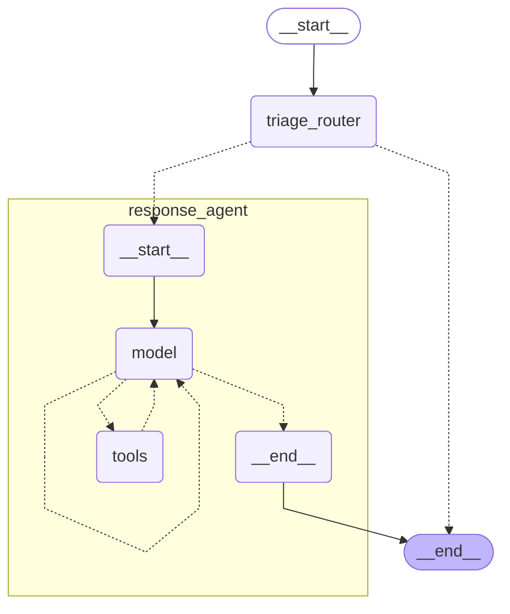

# 01_baseline

```mermaid
---
config:
  flowchart:
    curve: linear
---
graph TD;
	__start__([<p>__start__</p>]):::first
	triage_router(triage_router)
	__end__([<p>__end__</p>]):::last
	__start__ --> triage_router;
	triage_router -.-> __end__;
	triage_router -.-> response_agent\3a__start__;
	response_agent\3a__end__ --> __end__;
	subgraph response_agent
	response_agent\3a__start__(<p>__start__</p>)
	response_agent\3amodel(model)
	response_agent\3atools(tools)
	response_agent\3a__end__(<p>__end__</p>)
	response_agent\3a__start__ --> response_agent\3amodel;
	response_agent\3amodel -.-> response_agent\3a__end__;
	response_agent\3amodel -.-> response_agent\3atools;
	response_agent\3atools -.-> response_agent\3amodel;
	response_agent\3amodel -.-> response_agent\3amodel;
	end
	classDef default fill:#f2f0ff,line-height:1.2
	classDef first fill-opacity:0
	classDef last fill:#bfb6fc
```
