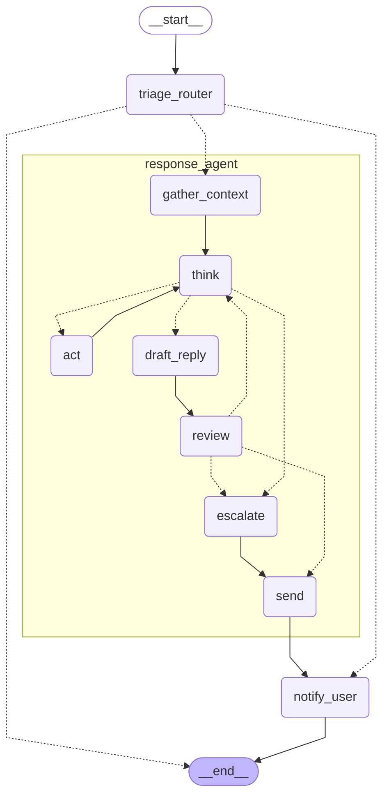

# 04_semantic_episodic_procedural

```mermaid
---
config:
  flowchart:
    curve: linear
---
graph TD;
	__start__([<p>__start__</p>]):::first
	triage_router(triage_router)
	notify_user(notify_user)
	__end__([<p>__end__</p>]):::last
	__start__ --> triage_router;
	response_agent\3asend --> notify_user;
	triage_router -.-> __end__;
	triage_router -.-> notify_user;
	triage_router -.-> response_agent\3agather_context;
	notify_user --> __end__;
	subgraph response_agent
	response_agent\3agather_context(gather_context)
	response_agent\3athink(think)
	response_agent\3aact(act)
	response_agent\3adraft_reply(draft_reply)
	response_agent\3areview(review)
	response_agent\3aescalate(escalate)
	response_agent\3asend(send)
	response_agent\3aact --> response_agent\3athink;
	response_agent\3adraft_reply --> response_agent\3areview;
	response_agent\3aescalate --> response_agent\3asend;
	response_agent\3agather_context --> response_agent\3athink;
	response_agent\3areview -.-> response_agent\3aescalate;
	response_agent\3areview -.-> response_agent\3asend;
	response_agent\3areview -.-> response_agent\3athink;
	response_agent\3athink -.-> response_agent\3aact;
	response_agent\3athink -.-> response_agent\3adraft_reply;
	response_agent\3athink -.-> response_agent\3aescalate;
	end
	classDef default fill:#f2f0ff,line-height:1.2
	classDef first fill-opacity:0
	classDef last fill:#bfb6fc
```
